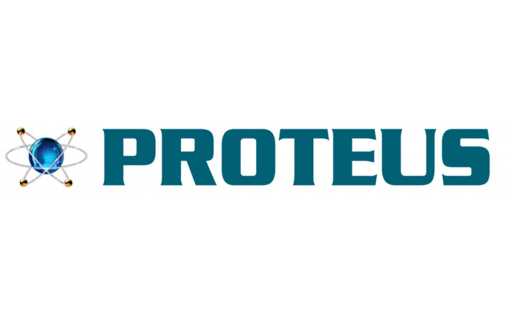

<h1 align="center">
   Hi , I'm Shreyash Patil 
</h1>

<h3 align="center">
Embedded Systems Engineer | Programming • Microcontrollers • HW–SW Integration • Automation
</h3>

<h1 align="center">

</h1>

---

## 🤝 Happy to Connect

  
  

---

## 👨‍💻 About Me
I am an **Embedded Systems Engineer** who enjoys working close to the hardware—writing **code**, understanding **microcontroller internals**, integrating, designing and debugging at the **board level**, automating, testing and validating systems end-to-end.
My work spans **firmware development, board-level testing and debugging, system bring-up and validation**, with a strong emphasis on **reliability, clarity, and disciplined engineering practices**. I value structured problem-solving and enjoy contributing to systems that scale cleanly from prototype to production.

---

## 🧠 Programming Languages

  
  &nbsp;&nbsp;&nbsp;&nbsp;
  
  &nbsp;&nbsp;&nbsp;&nbsp;
  
  &nbsp;&nbsp;&nbsp;&nbsp;
  

   • 
   • 
   • 
  

---

## 🖥️ Operating Systems

  
  &nbsp;&nbsp;&nbsp;&nbsp;
  
  &nbsp;&nbsp;&nbsp;&nbsp;
  

   • 
   • 
  

---

## 🔌 Microcontrollers & Platforms

   
  &nbsp;&nbsp;&nbsp;&nbsp;
  
  &nbsp;&nbsp;&nbsp;&nbsp;
  

   • 
   • 
  

---

## 🌐 Communication Protocols

  

   • 
   • 
   • 
   • 
   • 
   • 
   • 
  

---

## 🛠️ Tools & Software

### 🔹 Version Control & Collaboration

  
  &nbsp;&nbsp;&nbsp;&nbsp;
  
  &nbsp;&nbsp;&nbsp;&nbsp;
  
  &nbsp;&nbsp;&nbsp;&nbsp;
  

   • 
   • 
   • 
  

### 🔹 Development & Debugging
  

  
  &nbsp;&nbsp;&nbsp;&nbsp;
  
  &nbsp;&nbsp;&nbsp;&nbsp;
   
  &nbsp;&nbsp;&nbsp;&nbsp;
  

   • 
   • 
   • 
  

 
### 🔹 Simulation & Testing
  

  
  &nbsp;&nbsp;&nbsp;&nbsp;
  
  &nbsp;&nbsp;&nbsp;&nbsp;
  

   • 
   • 
  

### 🔹 Build & Productivity
  

  
  &nbsp;&nbsp;&nbsp;&nbsp;
  
  &nbsp;&nbsp;&nbsp;&nbsp;
  
  &nbsp;&nbsp;&nbsp;&nbsp;
  

   • 
   • 
   • 
  

---

## 🎓 Certifications & Badges
- **PG Diploma in Embedded Systems Design (PG-DESD)** – C-DAC  
  📄 [View Certificate](https://www.linkedin.com/in/shreyash-patil2002/overlay/1769975670573/single-media-viewer?type=IMAGE&profileId=ACoAAFASSwIBKXEIW50LB8DuUR3Fz6l8zVhSDak&lipi=urn%3Ali%3Apage%3Ad_flagship3_profile_view_base%3BiwSWWr%2FbTM%2BKHc1kpdUZjA%3D%3D)

- **C++ Programming Internship** – Pinnacle Labs  
  📄 [View Certificate](https://www.linkedin.com/in/shreyash-patil2002/overlay/1769961992042/single-media-viewer?type=DOCUMENT&profileId=ACoAAFASSwIBKXEIW50LB8DuUR3Fz6l8zVhSDak&lipi=urn%3Ali%3Apage%3Ad_flagship3_profile_view_base%3BiwSWWr%2FbTM%2BKHc1kpdUZjA%3D%3D)

- **Machine Learning with Python Internship** – YBI Foundation  
  📄 [View Certificate](https://www.linkedin.com/in/shreyash-patil2002/overlay/1769966404761/single-media-viewer?type=DOCUMENT&profileId=ACoAAFASSwIBKXEIW50LB8DuUR3Fz6l8zVhSDak&lipi=urn%3Ali%3Apage%3Ad_flagship3_profile_view_base%3BiwSWWr%2FbTM%2BKHc1kpdUZjA%3D%3D)

- **Credly (Additional Areas of Interest)**   
  📄 [View Badges](https://www.credly.com/users/shreyash-patil.5ec68049)

---

## 🏆 Notable Achievements
- 🥇 Outperformer – Embedded Systems & IoT Track, Technovation 2K24  
- 🎓 First Class with Distinction – B.E. (Electronics & Telecommunication)  
- 🎯 AIR 40 (Category III) – CDAC PreCAT (A+B+C)  
- 🎯 AIR 440 (Category II) – CDAC PreCAT (A+B)  
- 🏅 Gold Medalist – SilverZone International French Olympiad  

---

## 🏅 Engineering Focus

  
  &nbsp;&nbsp;
  
  &nbsp;&nbsp; 
  

---

## 🔍 Open to Roles
- Embedded Software / Firmware Engineer  
- Embedded Systems Engineer  
- Firmware Test & Validation Engineer  
